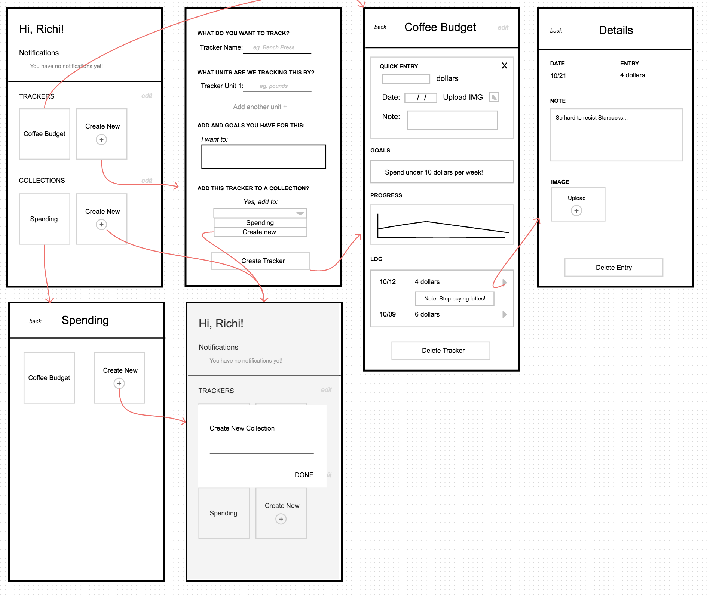
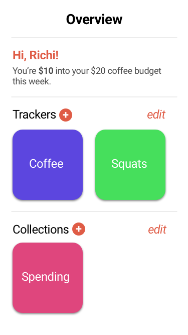
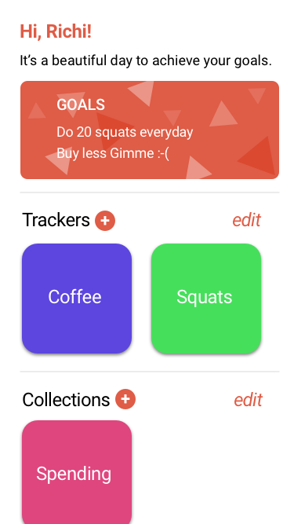
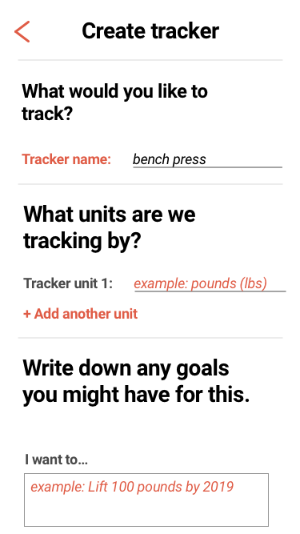
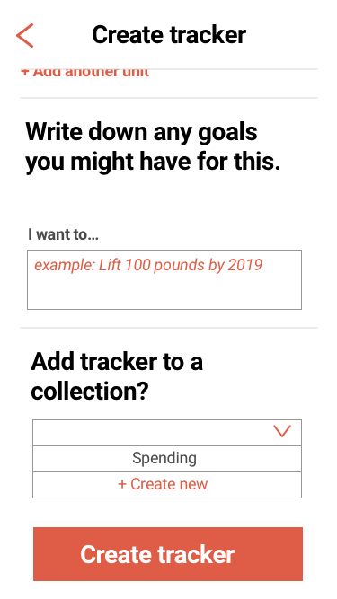
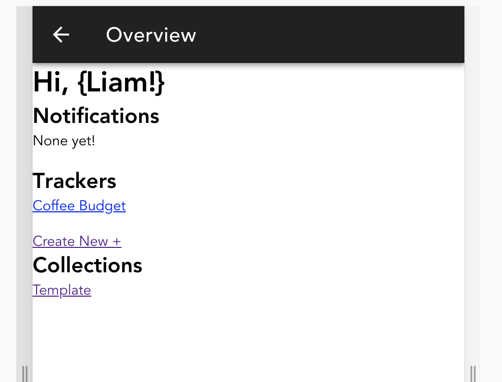
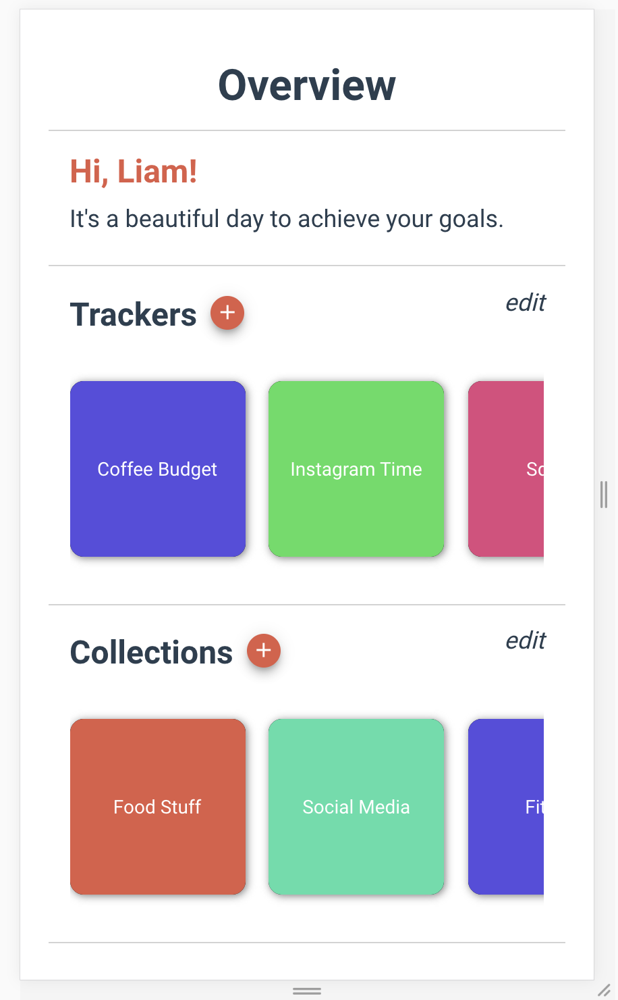
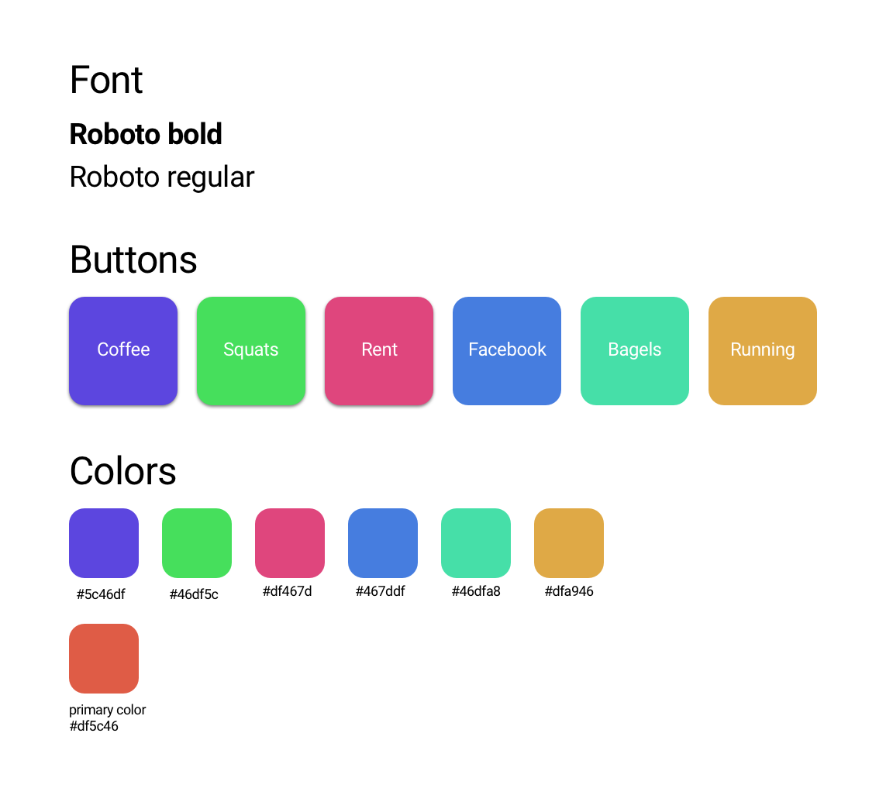

# Milestone 4 - Implementation

## Table of Contents
[1. Design Process Images](#design)

[2. Design Changes](#design-changes)

[3. Work Distribution](#work-distribution)

[4. Code Iteration Screenshots](#code-iteration-screenshots)

[5. Styleguide](#style-guide)

### Design

#### Original wireframes:

#### Planning for Implementation

Sketching out objects and components in the planning phase:

#### High Fidelities

**Home Page**

**Create Tracker**

### Design Changes

## Home Screen
Because of the horizontal scroll used for viewing trackers, we found that the original plan to have a “create tracker box” at the end of the scroll list, was not accessible for the user as they would need to scroll. Instead we added an easy to see plus button next to Collections and Trackers to indicate where to create new trackers.

## Add Entry
Our wireframes included entry-adding functionality on the main tracker page under the header “quick entry”. During development, we implemented this but found that it crowded the ViewTrackerScreen page, making it more difficult for the user to identify past data. 

### Sketch for new "Add Entry"

## All Edit Pages 
Our original wireframes did not include details about the editing of collections, trackers, or entries, though we described these as a requirement. For consistency, we decided to use the same styling and layout that we did for the View Pages of each element.

## Entry Images 
During implementation, we decided to forgo the ability to add images to an entry. After reevaluating our time constraints and user needs, we felt that images were not necessary for the MVP.

## Entry Viewing 
We changed our original plan to have a separate view-entry and edit-entry page for each entry. Because the images were no longer included as part of the entries, there was not a need for more extensive viewing page - everything could be viewed from the log. 

## Deleting Items
We added a warning pop-up for each time the user tries to delete a tracker, entry, or collection as a precaution. This was not in the original design.

### Work Distribution 

## Sarah 
* Handling and structuring local storage 
* Adding, editing and removing Trackers
* Adding, editing and removing Entries
* Populating Home Screen

## Liam
* Structuring navigation
* Username entry
* Warning and renaming popups
* Displaying entries on line graph
* Adding and renaming Collections

## Richi
* Creating entries
* Editing trackers
* Editing entries
* Sorting and displaying entry logs by date
* Sorting tracker list and collection list 

## Stephanie
* Style guide / Medium Fidelities
* Homepage formatting
* Random colors
* General Styling
* Button Styling
* Made style cohesive

## Lily 
* View/Edit tracker pages structure and styling
* Collection / Edit collection formatting
* Tracker log
* General styling 
* Navbar

### Code Iteration Screenshots

#### Style Guide

