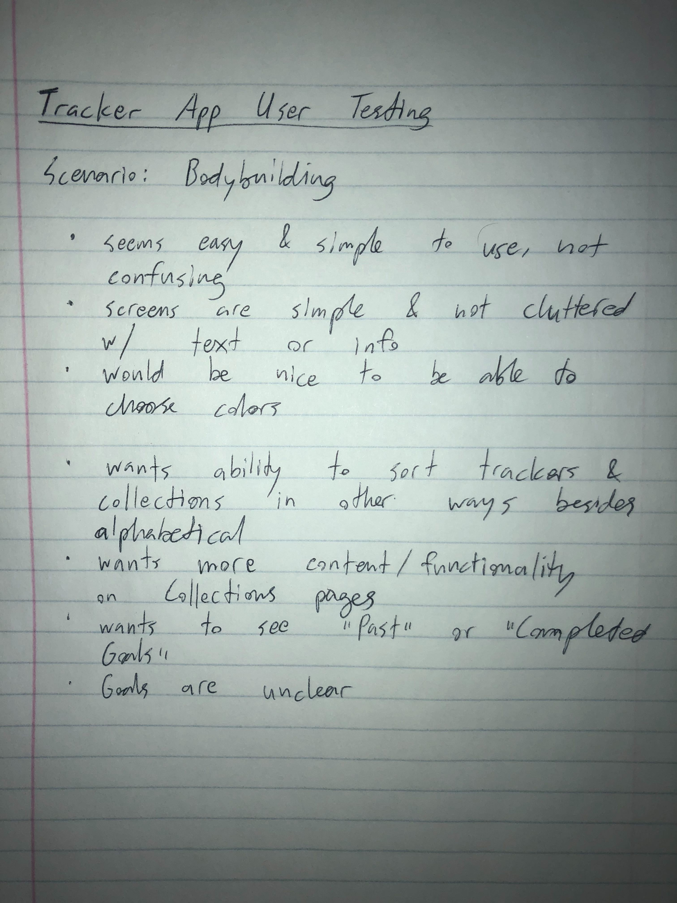

# Milestone 4 - Implementation

## Table of Contents
[1. User Testing](#user-testing)

[2. Debrief](#debrief)

[3. Work Distribution](#work-distribution)

[4. Deployment](#deployment)

### User Testing

We conducted 5 rounds of user testing with people from all of our target audiences. 
Our user testing protocol is linked here: 
https://docs.google.com/document/d/1YQ6xekJa4dEWInNQciaFO-H3uSenwT4ED93a8VOKLv8/edit

We tested 3 people from our Fitness user group, 1 person from our finance user group, 
and 1 person from our social media user group. 

### User Testing Notes: 

### Debrief

Overall, we had positive responses to our application design and a lot of of design decisions were validated 
through user testing. None of the users from our target audiences had major issues with the flow of our application, 
but there were small fixes that we recognized could help increase the user experience. 
Some of our users kept of sggesting additional features that might be interesting with the application, but
we were constantly evaluating feedback in conjuntion with our project themes. 

Comments from a user from our 
target groups included, " I'm very impressed. I like it that you aren’t just tracking one thing. 
You can choose what to track. The app is nice and simple and you don’t need to use multiple apps(Aubrey, Fitness)."

The fixes we found necessary to change after going through each of the user testing flows include:

### Fixing Delete Entry
* We found a small bug during testing, in which our entries would not accurately delete and fixed the bug. 
### Reduce Header size: 
* Feedback from our last milestone included reducing header size. We also noticed in 
testing that the text took a lot of space on the screen and would prevent users fro seeing content at the bottom. 
### Indicate Required Fields in Add Tracker
* In user testing, some users did not know which fields were required or optional. 
Our application does require some fields and so we indiated those with a *. 
### Placeholder Fields: 
* For users that might not be sure what value to enter in certain fields, adding placeholder
text will help them understand the purpose of the input without being intrusive. 
### Make Entries on 2 different dates more clear: 
* For successful graph functionality, our application requires that at least two entries
are made on two separate dates. We did not  make this direction clear and as a result, users were
getting confused when the graph did not show. 
### Add a create collection button when creating a tracker
* By adding a create collection button in the 'create tracker flow,' users use less clicks to organize their data. 
### Change wording on delete collection
* Previously, users were confused how their trackers would be affected by deleting a collection. 
We added wording on the 'delete collection popup' to clarify trackers would not be affected. 

### Work Distribution 

#### Steph
* Contributed to debrief changes
* Designed Logo
* Wrote up user testing protocol 
* Presentation preparation

#### Lily 
* Conducted User testing 
* Wrote up user testing protocol 
* Presentation preparation

#### Liam
* Conducted User testing 
* Wrote up user testing protocol 
* Contributed to debrief changes
* Physically deployed app 
* Presentation preparation

#### Richi
* Conducted User testing 
* Contributed to debrief changes
* Presentation preparation

#### Sarah
* Conducted User testing 
* Contributed to debrief changes
* Presentation preparation
* Put together write-up

### Deployment 

Deployed URL: https://track-dat.herokuapp.com/

